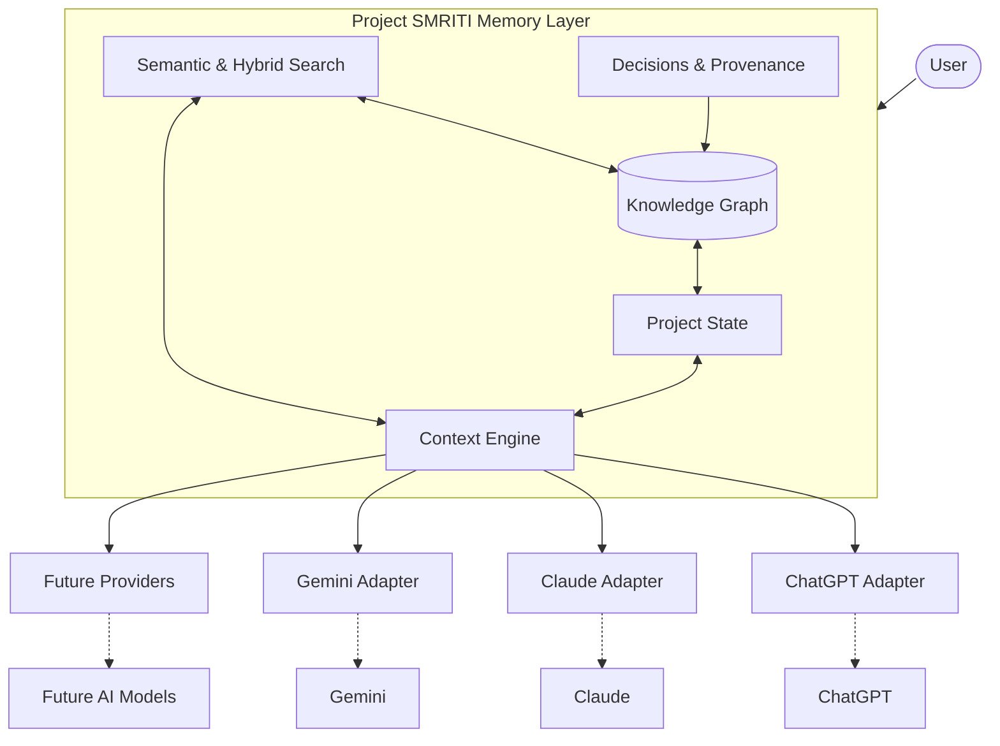
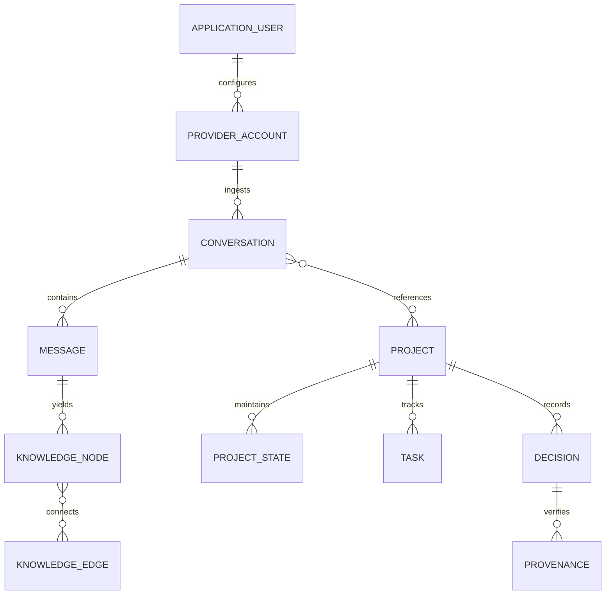
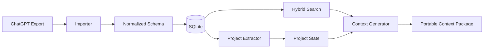

# Project SMRITI

> **A persistent, portable personal AI memory layer for connecting knowledge across ChatGPT, Claude, Gemini, and future AI platforms.**

---

## Vision

The fundamental principle of **Project SMRITI** (*Smriti* meaning memory or remembrance in Sanskrit) is simple:

> **My knowledge belongs to me, not to a particular AI platform.**

Today, users build substantial context, design decisions, architectural roadmaps, and problem-solving history across different conversational AI tools. However, each platform operates as an isolated silo. SMRITI provides a unified, personal, and portable memory layer that sits above conversational AI providers, enabling users to carry forward their accumulated knowledge and project state seamlessly across tools without vendor lock-in.

---

## The Problem

Modern workflows frequently span multiple AI ecosystems—a user may sketch architectural concepts in Claude, draft implementations in ChatGPT, and run deep document research in Gemini. This fragmented workflow creates friction:

1. **Context Fragmentation**: High-value reasoning, design trade-offs, and decisions are trapped inside individual vendor chat histories.
2. **Repetitive Onboarding**: Starting a new session or switching platforms requires re-explaining the entire project background, architecture, and previous decisions.
3. **Loss of Provenance**: Users cannot easily track which model suggested a solution, when an architectural pivot was decided, or where a code snippet originated.
4. **Context Window Exhaustion**: Blindly pasting historical transcripts into prompts quickly saturates context windows and degrades model attention.
5. **Vendor Enclosure**: Switching models or adopting newly emerging AI platforms requires leaving years of synthesized dialogue and project insights behind.

---

## The Core Idea

SMRITI does **not** attempt to synchronize raw chat transcripts or mirror active runtime sessions across providers. 

Instead, SMRITI extracts, normalizes, and maintains **structured project state and relational knowledge** independent of the underlying AI provider. By distilling conversations into a structured knowledge graph and dynamic project memory, SMRITI synthesizes compact, goal-driven context packages tailored for immediate consumption by whatever AI platform the user chooses next.

---

## Why SMRITI?

* **Provider Agnostic**: Treats all AI models as swappable reasoning engines rather than closed knowledge vaults.
* **Intelligent Compression**: Employs hybrid retrieval and graph traversal to pass only relevant decisions and active tasks, rather than unbounded raw transcripts.
* **Preserved Provenance**: Every entity, decision, and solution retains cryptographic and chronological references to its source conversation and model.
* **User Sovereignty**: Built with a local-first philosophy ensuring all personal data, graphs, and memories remain strictly under the user's custody.

---

## How It Works

1. **Ingest**: Import conversations via provider data exports or authorized API connections.
2. **Normalize**: Map raw messages from various platforms into a unified conversation schema.
3. **Extract**: Identify key entities, relationships, design decisions, blockers, and deliverables.
4. **Graph & State Synthesis**: Update the unified Knowledge Graph and reconcile individual Project States.
5. **Context Generation**: When continuing work, retrieve relevant graph nodes and active project state to build a compact, targeted context package.
6. **Hand-off**: Provide the portable context bundle to the destination AI (ChatGPT, Claude, Gemini, or future platforms).

---

## High-Level Architecture

The conceptual architecture positions SMRITI as an independent abstraction layer between the user and AI providers:



---

## Core Capabilities

### Multi-AI Support
SMRITI bridges conversations from disparate AI environments, ensuring consistent project progression regardless of whether work was performed in ChatGPT, Claude, Gemini, or future LLM platforms.

### Multiple AI Accounts
Users frequently operate multiple personas across personal, academic, and professional accounts. SMRITI models provider accounts as independent connection entities:

```text
Application User
│
├── ChatGPT Connection
│   ├── Personal
│   ├── College
│   └── Work
│
├── Claude Connection
│   ├── Personal
│   └── Work
│
└── Gemini Connection
    ├── Personal
    └── Research
```
Account identities are treated as discrete connections with granular boundary controls, rather than relying on email addresses as universal keys.

### Unified Knowledge Graph
SMRITI structures extracted dialogue insights into an interconnected entity graph to model dependencies, decisions, and concepts.

#### Node Types
* **User**: The owner of the memory space.
* **ProviderAccount**: A specific connected account (e.g., Claude Work, ChatGPT Personal).
* **Conversation**: A normalized session container.
* **Message**: An individual turn containing source content and timestamps.
* **Project**: A high-level initiative (e.g., mobile app, research paper).
* **Topic**: Domain concepts discussed across sessions.
* **Technology**: Specific tools, libraries, or frameworks (e.g., FastAPI, React).
* **Person**: Collaborators or references mentioned in context.
* **Decision**: Architectural choices, design directions, or strategy locks.
* **Problem**: Identified technical blockers, bugs, or challenges.
* **Solution**: Proposals, workarounds, or validated fixes.
* **Concept**: Theoretical models, algorithms, or definitions.
* **Task**: Actionable items and work units.
* **Constraint**: Technical, budgetary, or structural boundaries.
* **Reference**: Documentation links, citations, or external URLs.

#### Relationship Types
```text
Conversation  ──contains───────> Message
Conversation  ──discusses──────> Project
Conversation  ──mentions───────> Technology
Conversation  ──produced───────> Decision
Decision      ──related_to─────> Project
Problem       ──has_solution───> Solution
Project       ──contains───────> Task
Task          ──depends_on─────> Task
Conversation  ──continues──────> Conversation
Concept       ──related_to─────> Concept
```

### Project State
To eliminate redundant prompt backstories, each project tracks structured, live metadata:

```text
Project
├── Goal
├── Current status
├── Architecture
├── Tech stack
├── Constraints
├── Decisions
├── Completed work
├── In-progress work
├── Open problems
├── Next steps
└── Relevant conversations
```

When a user initiates a continuation prompt (*"Continue this project"*), SMRITI injects this concise synthesis rather than thousand-line raw transcripts.

### Context Engine
The Context Engine compiles goal-oriented packages by pruning irrelevant noise and prioritizing active context:

```text
User Query
    │
    ▼
Semantic & Hybrid Search
    │
    ▼
Knowledge Graph Traversal
    │
    ▼
Relevant Entity & Fact Nodes
    │
    ▼
Relevant Conversation Fragments
    │
    ▼
Active Project State
    │
    ▼
Context Builder (Budget & Token Optimizer)
    │
    ▼
Compact Context Package
    │
    ▼
Selected Destination AI Platform
```

### Cross-AI Continuation
SMRITI allows switching providers on the fly with targeted context handoffs:

```text
My Projects

Project: Physio App
Last activity: Claude
Status: Live guidance implementation

[ Continue with ChatGPT ]  [ Continue with Claude ]  [ Continue with Gemini ]
```

When triggered, SMRITI generates an optimized prompt package providing the target AI with the exact architecture, settled decisions, unresolved blockers, and immediate tasks needed to proceed.

### "What Did We Do Last?"
Provides instantaneous contextual recall across sessions, highlighting recent decisions, updated files, open questions, and next steps across any connected AI model without manual transcript digging.

### Provenance
Every piece of information extracted into SMRITI answers the question: **Where did this information come from?**
Nodes link directly to their source message IDs, conversation timestamps, provider accounts, and originating models, ensuring full transparency and verification.

### Knowledge Sharing
Enables explicit, selective export and sharing of specific subgraphs or project contexts (e.g., handing off an architectural decision record to a teammate) while keeping private notes and unconnected dialogues secure.

### Multiple Knowledge Spaces
Isolates workspaces cleanly into discrete partitions (e.g., `Personal`, `Enterprise Client A`, `Academic Research`) to guarantee zero accidental leakage of context between domains.

### Timeline
Chronological view tracing project evolution, milestone completions, architectural pivots, and technical explorations across all connected models over time.

### AI Comparison
Side-by-side analysis of how different models handled similar challenges, code proposals, or technical evaluations within the same project.

---

## Privacy by Design

Privacy is a fundamental requirement of Project SMRITI:
* **Local-First Architecture**: Storage and indexing reside locally on user-controlled hardware.
* **No Third-Party Password Storage**: SMRITI never asks for, captures, or stores AI provider account passwords.
* **Explicit Boundary Controls**: Knowledge is never silently shared or aggregated across disconnected accounts.
* **Safe Exports**: Private conversation exports and raw transcripts are isolated locally and must never be committed to source repositories.
* **Auditability & Provenance**: Full visibility into what context is retrieved, packaged, and transmitted to external APIs.

---

## Provider Independence

SMRITI enforces strict decoupling from proprietary AI platform behaviors:
> **SMRITI must not assume that ChatGPT, Claude, Gemini, and future AI platforms expose identical APIs or identical access to conversation history.**

To maintain neutrality and resilience against platform deprecations, integrations will follow a modular adapter pattern:

```text
providers/
├── base/           # Universal interface definitions
├── chatgpt/        # ChatGPT export parsing & API handling
├── claude/         # Claude export parsing & API handling
└── gemini/         # Gemini export parsing & API handling
```

Initial capabilities will rely on user-provided data exports, structured manual imports, and official provider APIs. Universal real-time background sync is neither assumed nor guaranteed without official provider API support.

---

## Proposed Technology Stack

> *Note: These are proposed technologies for future evaluation and implementation; no code is currently deployed.*

| Subsystem | Proposed Technology | Rationale |
| :--- | :--- | :--- |
| **Backend** | Python, FastAPI, Pydantic, SQLAlchemy | Fast iteration, robust typing, ecosystem support for LLM pipelines. |
| **Relational Storage** | SQLite | Serverless, local-first, zero-setup, portable data storage. |
| **Graph Modeling** | NetworkX (initial), Neo4j (future evaluation) | Rapid in-memory prototyping transitioning to specialized graph engines if scale demands. |
| **Frontend** | React, TypeScript, Cytoscape.js / React Flow | Interactive, visual graph exploration and state management. |
| **Search & Retrieval** | SQLite FTS5, Embeddings, Vector Search | Hybrid keyword-plus-semantic retrieval for high precision context assembly. |

---

## High-Level Data Model

The data layer models relationships between identity, conversation sessions, and semantic knowledge:



---

## Development Roadmap

The planned phased development sequence:

* [ ] **V0 — ChatGPT Importer**: Ingest and parse official ChatGPT export bundles into normalized JSON schemas.
* [ ] **V1 — Multi-AI Importer**: Add support for Claude and Gemini data export formats.
* [ ] **V2 — Entity Extraction**: Offline extraction of decisions, technologies, tasks, and problems from message bodies.
* [ ] **V3 — Knowledge Graph**: Build local graph representation linking conversations, concepts, and technologies.
* [ ] **V4 — Semantic Search**: Vector embeddings and hybrid keyword retrieval across stored entities and transcripts.
* [ ] **V5 — Project Memory**: Automatic extraction and synthesis of structured Project State files.
* [ ] **V6 — Cross-AI Continuation**: Context package generator for launching tasks in target AI platforms.
* [ ] **V7 — Multiple Provider Accounts**: Support discrete multi-account connection management (e.g., Work vs Personal).
* [ ] **V8 — Knowledge Sharing**: Selective subgraph export and privacy-safe project sharing.
* [ ] **V9 — Timeline + AI Comparison**: Temporal visualization of project evolution and model suggestion comparison.
* [ ] **V10 — Privacy & Security Hardening**: End-to-end local encryption, vault sanitization, and automated secret redaction.

---

## MVP Scope

The initial Minimum Viable Product (MVP) is deliberately constrained to prove end-to-end pipeline feasibility without over-engineering:



1. Parse official ChatGPT archive export.
2. Store normalized dialogues in local SQLite.
3. Index conversation content for basic hybrid search.
4. Manually or semi-automatically group conversations into a Project.
5. Generate a structured Markdown `Project State`.
6. Output a compact, copy-ready Context Package for pasting into any alternative AI.

---

## Current Status

> **Status: Concept / Architecture Phase**
>
> Project SMRITI is a **future personal project**. Implementation will begin only after the current hackathon is completed.

---

## Future Vision

The ultimate ambition for SMRITI is to serve as an ambient, decentralized cognitive substrate. As conversational interfaces transition into autonomous multi-agent swarms, SMRITI envisions an open standard for agent memory exchange where users seamlessly delegate goals to specialized models while retaining total ownership, provenance, and auditability over their personal intellectual journey.

---

## Technical Constraints

The system will strictly adhere to the following architectural constraints:
1. **Zero Credential Exposure**: Never prompt for, store, or handle raw AI provider passwords.
2. **Provider-Approved Authentication**: Rely strictly on standard API tokens, OAuth, or offline user export archives.
3. **No Parity Assumptions**: Assume zero feature parity across providers; build independent adapters for each.
4. **Pre-Integration Verification**: Audit provider terms of service, API rates, and format stability prior to developing automations.
5. **Mandatory Provenance**: Every extracted node or fact must link to verifiable source identifiers.
6. **User Data Sovereignty**: Storage remains local-first and under direct user file system governance.
7. **Zero Cross-Account Leakage**: Maintain strict isolation boundaries between different connected accounts.
8. **Token-Budget Discipline**: Deliver high-density, concise summaries rather than raw conversation flooding.
9. **No Unofficial Endpoints**: Refuse reliance on undocumented reverse-engineered web endpoints that violate provider policies.
10. **Zero Sensitive Commits**: Strictly exclude conversation archives, personal notes, and credentials from git repositories.

---

## Major Technical Risks

| Risk Category | Technical Description | Mitigation Strategy |
| :--- | :--- | :--- |
| **Provider API Volatility** | Changes or deprecations in official provider export formats or APIs break ingest pipelines. | Abstract schema normalization via isolated, versioned provider adapters. |
| **Context Poisoning** | Hallucinated or erroneous statements from past AI chats get extracted into graph memory as facts. | Require human-in-the-loop validation for key decisions and preserve explicit provenance links. |
| **Graph Complexity Explosion** | Ingesting extensive chat logs produces bloated, unmanageable entity graphs. | Enforce strict entity schemas and decay / prune transient conversational entities. |
| **Stale Project State** | Codebases evolve independently, rendering memory layer project states obsolete. | Anchor states to lightweight verification timestamps and explicit user milestone triggers. |
| **Privacy Leakage** | Accidentally mixing confidential corporate discussions with personal project memories. | Strict workspace segmentation and explicit per-project account binding rules. |

---

## Why This Project Matters

AI systems are rapidly moving from one-off queries to persistent collaborators across every domain of intellectual work. Yet as long as user memory remains locked within corporate cloud ecosystems, users face an artificial dilemma: stay locked into a single provider, or sacrifice their accumulated history every time they switch platforms.

**Project SMRITI** reclaims personal intelligence sovereignty. By establishing an open, portable, and provider-agnostic memory layer, SMRITI ensures that your thinking, decisions, and creative journey remain exactly where they belong: **with you**.
